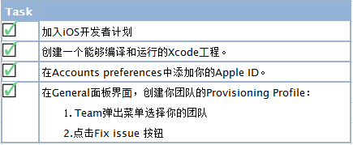

# 启动 HomeKit

HomeKit 应用服务只提供给通过 App Store 发布的 app 应用程序。     在你的 Xcode 工程中， HomeKit 应用程序需要额外的配置，你的 app 必  须有开发证书和代码签名才能使用 HomeKit。在 Xcode 的   Capabilities 面板使用 HomeKit，可避免代码签名的问题。你无需直接  在 Xcode 或者会员中心编辑授权文件（entitlements）。       

# 设置

1. 一个安装 Xcode 6 或者 Xcode 6 以上版本的Mac电脑。  
2. 为了获得最佳体验，你的 Mac 电脑上最好安装最新的 OS X 系统和最新的 Xcode 版本。
3. 加iOS开发者计划。
4. 在Member Center 拥有创建代码签名和资源配置的权限。

在你开始使用 HomeKit 之前，请确保你已经完成以下任务。创建你团队的   配置文件（Provisioning Profile），请参阅：[App Distribution Quick Start](https://developer.apple.com/library/ios/documentation/IDEs/Conceptual/AppStoreDistributionTutorial/Introduction/Introduction.html#//apple_ref/doc/uid/TP40013839) .

当你成功地完成了之前的任务后，General 面板中 Team 弹出菜单中的错误信息和问题修复按钮将会消失。代码签名配置被成功创建后会展示下方的 General 面板。

解决代码签名和证书配置问题，请参阅[ App Distribution Guide](https://developer.apple.com/library/ios/documentation/IDEs/Conceptual/AppDistributionGuide/Introduction/Introduction.html#//apple_ref/doc/uid/TP40012582)文档中 [Troubleshooting ](https://developer.apple.com/library/ios/documentation/IDEs/Conceptual/AppDistributionGuide/Troubleshooting/Troubleshooting.html#//apple_ref/doc/uid/TP40012582-CH5)这一节。

# 启用HomeKit

想要使用 HomeKit ，首先要启用它。Xcode 将会添加 HomeKit 权限到你的工程授权文件中和会员中心的 App ID授权文件中，也会将 HomeKit框架添加到你的工程中。HomeKit 需要一个明确的 App ID, 这个 App ID 是为了你完成这些步奏而创建的。

启用 HomeKit 的步骤如下：

1. 在 Xcode 中，选择 View > Navigators > Show Project Navigator。
2. 从 Project/Targets 弹出菜单中 target（或者从 Project/Targets 的侧边栏）
3. 点击 Capabilities 查看你可以添加的应用服务列表。

# 下载 HomeKit Accessory Simulator

无需为了开发 Homekit 应用程序而购买硬件产品。你可以使 HomeKit Accessory Simulator 来测试 HomeKit app 和模拟配件设备之间的通信。HomeKit Accessory Simulator 不是和 Xcode 一起发布的。 

下载 HomeKit Accessory Simulator 步骤如下：

1. 在 Capabilities 面板的 HomeKit 分区，点击 Download HomeKit Accessory Simulator 按钮。（或者选择 Xcode > Open Developer Tool > More Developer Tools）
2. 在浏览器中搜索并且下载" Hardware IO Tools for Xcode ".dmg文件。
3. 在 Finder 中双击~/Downloads 中的.dmg 文件。
4. 把 HomeKit Accessory Simulato r拖拽到/Application 文件中。

之后，你将可以使用 HomeKit Accessory Simulator 测试你的HomeKit 应用程序，正如[ Testing YourHomeKit App](https://developer.apple.com/library/ios/documentation/NetworkingInternet/Conceptual/HomeKitDeveloperGuide/TestingYourHomeKitApp/TestingYourHomeKitApp.html#//apple_ref/doc/uid/TP40015050-CH7-SW1)（第30页）中描述的那样。
